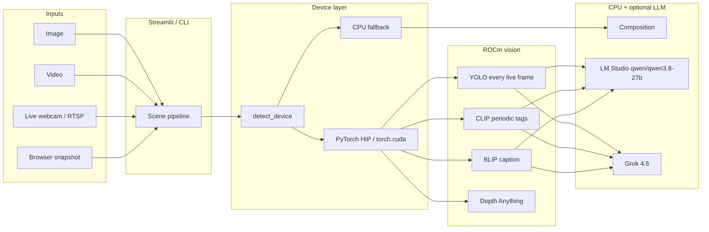

# ROCm Scene Analysis

A local scene-analysis app that runs vision models on **AMD GPUs through ROCm** (PyTorch HIP) and serves a **Streamlit** UI. The same pipeline is available from the command line.

On ROCm builds of PyTorch the `torch.cuda` API is the HIP compatibility layer, so the same code path targets AMD Instinct and supported Radeon GPUs. Without a GPU it falls back to CPU (or DirectML on Windows if `torch-directml` is installed).

## Capabilities

### Inputs

| Source | What it does |
| --- | --- |
| **Upload image** | Still photo (`jpg`, `jpeg`, `png`, `bmp`, `webp`). Full analysis in one pass. |
| **Upload video** | Samples frames evenly through the clip and reports objects over time. The file is written under `outputs/` so it can be re-read. |
| **Live camera** | Continuous webcam, `/dev/video*`, or **RTSP/HTTP** stream on the Streamlit **host**. YOLO on every frame. **Frames are not saved to disk.** |
| **Camera snapshot** | One still from the **browser** camera (the laptop or phone viewing the page). |
| **Synthetic demo** | Built-in test scene so the UI works without a photo. |

### Vision tasks

| Task | Model | Default | Notes |
| --- | --- | --- | --- |
| Object detection | YOLO (`yolo11n` / `yolo11s` / `yolov8n` / `yolov8s`) | On | Bounding boxes + class counts |
| Scene tags | CLIP ViT-B/32 (zero-shot) | On | Indoor/outdoor, street, kitchen, forest, … |
| Caption | BLIP | Off | Natural-language description |
| Depth | Depth Anything V2 Small | Off | Relative depth map (Turbo colormap) |
| Composition | CPU (no extra weights) | On | Palette, brightness, contrast, saturation, sharpness, rule of thirds |
| Scene narrative | **LM Studio** (dropdown of every downloaded LLM; prefers `qwen/qwen3.8-27b`) or SpaceXAI `grok-4.6` | Off | Optional write-up from detections. LM Studio is **text-only** unless you opt in to send the photo |

Results include an annotated overlay, timings per task, JSON export, and (for video) a per-frame breakdown.

### Live camera

Live mode is a realtime feed, not a snapshot.

- Opens a device on the **machine running Streamlit** (USB webcam index `0`, `1`, …; a path like `/dev/video0`; or `rtsp://host/stream`).
- It is **not** the browser camera. Use **Camera snapshot** to grab a still from the device viewing the page.
- YOLO runs on **every frame**. Models stay resident in VRAM while the feed is running.
- CLIP scene tags and composition refresh every **N** frames (default 15) so the overlay stays realtime. The last tags stay on screen between refreshes.
- Caption, depth, and the LLM narrative stay off unless you enable **Allow caption/depth on live** (slow). The LLM narrative is never called from the live loop.
- The UI shows FPS, frame count, object count, backend (`ROCM` / `CUDA` / `CPU`), and a live class histogram.
- **Probe local cameras** tries indexes 0–5 and lists devices that returned a frame.
- Capture sizes: 640×480, 1280×720, 1920×1080.
- **No disk writes.** Each frame is read into RAM, analyzed, drawn in the UI, then discarded when the next frame arrives. Session state keeps only tags, class counts, FPS, and frame index — not pixels. A long live session will not fill the disk. (Uploaded videos are the exception: they are stored under `outputs/`.)

If Zoom or Teams has the webcam, release it first. Capture backends: DirectShow / Media Foundation on Windows, AVFoundation on macOS, V4L2 on Linux, FFmpeg for RTSP.

The CLI live window (`python -m scene_analysis --live`) is the same: OpenCV preview only, no image files written.

## Architecture



## Requirements

| Piece | Notes |
| --- | --- |
| Python | 3.10–3.12 recommended (PyTorch ROCm wheels). 3.13+ may lack GPU wheels. |
| AMD GPU + ROCm | Linux or WSL2. Official ROCm PyTorch wheels are not native Windows. |
| Camera (optional) | USB webcam, V4L2 device, or RTSP/HTTP URL for live mode. |
| LM Studio (optional) | Local OpenAI-compatible server at `http://localhost:1234/v1`. Default narrative model: `qwen/qwen3.8-27b`. |
| Disk | First run downloads YOLO (~6 MB), CLIP (~150 MB), optional BLIP (~900 MB) and Depth Anything. |

Windows hosts can still run the Streamlit app on **CPU**, or put the GPU path in **WSL2 + ROCm**. DirectML is used automatically if `torch-directml` is installed. WSL2 often does **not** see a USB webcam unless it is attached to the distro.

## Install

```bash
git clone <this-repo> scene-analysis-rocm
cd scene-analysis-rocm
python3.11 -m venv .venv
source .venv/bin/activate          # Windows: .venv\Scripts\Activate.ps1
python -m pip install --upgrade pip
```

### 1. PyTorch with ROCm (Linux / WSL2)

Pick the index that matches your installed ROCm. Confirm at [pytorch.org/get-started](https://pytorch.org/get-started/locally/) if AMD has published a newer wheel.

```bash
# ROCm 6.3
#pip install torch torchvision --index-url https://download.pytorch.org/whl/rocm6.3

# ROCm 7.0
pip install torch torchvision --index-url https://download.pytorch.org/whl/rocm7.0
```

Or let the helper choose:

```bash ** USE THIS ONE
python scripts/install_torch.py --run
```

Verify HIP is live (this must print `True` and a HIP version, not `None`):

```bash
python -c "import torch; print(torch.__version__, torch.version.hip, torch.cuda.is_available(), torch.cuda.get_device_name(0) if torch.cuda.is_available() else 'cpu')"
```

### 2. App dependencies

```bash
pip install -e .
cp .env.example .env    # LM Studio URL/model; XAI_API_KEY only if you use Grok
```

### CPU-only (Windows or no GPU)

```bash
pip install torch torchvision --index-url https://download.pytorch.org/whl/cpu
pip install -e .
```

## Run the web UI

```bash
streamlit run app.py
```

Linux helper: `./run.sh`  
Windows helper: `.\run.ps1`

Open http://localhost:8501.

### Sidebar

- Resolved backend (`ROCM` / `CUDA` / `DIRECTML` / `CPU`), GPU name, HIP / ROCm versions
- **Probe ROCm stack** — `rocminfo` / `rocm-smi` snapshot
- **GEMM smoke test** — 2048³ FP32 matmul on the resolved device
- Detector weights, confidence threshold, **Keep models in VRAM**
- Per-task checkboxes (detect, scene, composition, caption, depth, **LLM scene narrative**)
- When narrative is on, **Narrative provider**:
  - **LM Studio (local)** — default. URL `http://localhost:1234/v1`. **LM Studio model** is a dropdown of **all downloaded LLMs** (not only the one currently loaded). Loaded models sort first; embeddings are omitted. Prefers `qwen/qwen3.8-27b` when present. **Refresh model list** re-queries the catalog. If the server is down, a manual model id field is shown instead. **Send snapshot** stays **off** for text models.
  - **Grok 4.6 (SpaceXAI)** — uses `XAI_API_KEY` and `grok-4.6`
- Video sample-frame count

### Main pane

Pick an input, then **Analyze scene** (still image, video, snapshot, demo). For **Live camera**, use **Start live feed** / **Stop** instead of Analyze.

Tabs after a still analysis: Overview, Detections, Composition, Depth, Performance, JSON.

## CLI

```bash
# Device diagnostics
python -m scene_analysis --probe

# Image
python -m scene_analysis photo.jpg --tasks detect,scene,composition --overlay out.png --json out.json

# Video (evenly samples frames)
python -m scene_analysis clip.mp4 --tasks detect,scene --max-frames 12 --json video.json

# Live webcam (OpenCV window, press Q to quit)
python -m scene_analysis --live --camera 0 --tasks detect,scene

# IP / RTSP camera
python -m scene_analysis --live --camera rtsp://10.0.0.8/stream --width 1280 --height 720 --tag-every 15

# Scene narrative via LM Studio (text-only; uses the loaded checkpoint if ids differ)
python -m scene_analysis photo.jpg --tasks detect,scene,narrative --narrative-provider lmstudio --llm-model qwen/qwen3.8-27b

# Vision checkpoint in LM Studio only
python -m scene_analysis photo.jpg --tasks detect,scene,narrative --llm-image

# Scene narrative via Grok 4.6
python -m scene_analysis photo.jpg --tasks detect,scene,narrative --narrative-provider grok
```

| Flag | Meaning |
| --- | --- |
| `--live` | Open a live camera / RTSP preview (no input file required) |
| `--camera` | Device index, path, or URL (default `0`) |
| `--tag-every N` | Refresh CLIP / composition every N live frames (default 15) |
| `--width` / `--height` | Capture size for live mode (default 1280×720) |
| `--allow-slow` | Run caption / depth on the live refresh interval |
| `--tasks` | Comma-separated: `detect`, `scene`, `caption`, `depth`, `composition`, `narrative`/`grok`, or `all` |
| `--narrative-provider` | `lmstudio` (default) or `grok` |
| `--llm-model` | Model id (`qwen/qwen3.8-27b` for LM Studio, `grok-4.6` for Grok) |
| `--lm-studio-url` | LM Studio base URL (default `http://localhost:1234/v1`) |
| `--llm-image` | Send the photo to LM Studio (off by default; vision checkpoints only) |
| `--conf` | Detection confidence (default 0.25) |
| `--keep-loaded` | Keep weights in VRAM (live mode does this automatically) |
| `--overlay` / `--json` | Write annotated PNG / analysis JSON (still images) |
| `--max-frames` | Frames to sample from a video file |
| `--probe` | Print ROCm / PyTorch diagnostics and exit |

`all` does **not** include `narrative`. Add `narrative` (or `grok`) explicitly. The LLM is skipped in live mode even if requested.

## Docker (Linux + AMD GPU)

```bash
docker compose up --build
```

The compose file passes `/dev/kfd` and `/dev/dri` through, which is what ROCm needs inside the container. For a live webcam inside Docker you also need to pass the video device (for example `--device /dev/video0`).

## Scene narrative (optional)

YOLO/CLIP/BLIP stay on the local GPU. The LLM write-up is a separate step on stills (image, snapshot, or sampled video frames). Enable **LLM scene narrative** in the sidebar, then pick a provider.

| Provider | Default model | Where it runs |
| --- | --- | --- |
| **LM Studio (local)** — default | `qwen/qwen3.8-27b` | `http://localhost:1234/v1` (`/v1/chat/completions`) |
| **Grok 4.6 (SpaceXAI)** | `grok-4.6` | `https://api.x.ai/v1` (Responses API) |

Both providers get the same ROCm detections, scene tags, caption, and composition JSON. Live camera never calls the LLM.

### LM Studio (default)

1. Download the checkpoints you want in [LM Studio](https://lmstudio.ai) (including `qwen/qwen3.8-27b` if you want the default)
2. Start the local server
3. In the Streamlit sidebar, enable **LLM scene narrative** and leave the provider on **LM Studio (local)**
4. Choose a model from the **LM Studio model** dropdown. After you download a new checkpoint, click **Refresh model list**

The dropdown is filled from, in order:

1. `GET http://localhost:1234/api/v1/models` (native catalog)
2. `GET http://localhost:1234/api/v0/models` (downloaded **and** loaded)
3. OpenAI-compatible `GET /v1/models` (often only the loaded model)
4. `lms ls --json` if the HTTP catalog is empty

Embedding models are left out. Currently loaded LLMs appear first. If `qwen/qwen3.8-27b` (or a close id such as a GGUF filename) is in the catalog, that row is pre-selected. If the server cannot be reached, the sidebar falls back to a text field for the model id.

The app posts the detections as **text**. **Send snapshot to the local model** stays **off** — `qwen/qwen3.8-27b` cannot take images.

When you analyze, the selected id is mapped onto the catalog so LM Studio does not try to download a Hugging Face-style name that is not actually on disk.

| Env var | Default | Purpose |
| --- | --- | --- |
| `LM_STUDIO_BASE_URL` | `http://localhost:1234/v1` | OpenAI-compatible base URL (origin is also used for `/api/v0` and `/api/v1`) |
| `LM_STUDIO_MODEL` | `qwen/qwen3.8-27b` | Preferred dropdown selection when that id (or a close match) is in the catalog |
| `LM_STUDIO_API_KEY` | `lm-studio` | Dummy key; the OpenAI SDK requires a string, LM Studio ignores it |

CLI: `--narrative-provider lmstudio --llm-model qwen/qwen3.8-27b`. Add `--llm-image` only for a vision checkpoint.

#### If narrative fails with `fetch failed`

`Error code: 400 … Engine protocol predict request failed: fetch failed` is an LM Studio engine error. Typical causes:

1. **Photo sent to a text model** — leave **Send snapshot** unchecked (CLI: do not pass `--llm-image`).
2. **Model id mismatch** — pick the exact row from the dropdown (use **Refresh model list**), or load that checkpoint in LM Studio before analyzing.
3. **Empty catalog / server down** — start the LM Studio server, download at least one LLM, then refresh. The dropdown should list every downloaded LLM, not only the loaded one.

YOLO/CLIP scene analysis still runs when the LLM step fails; only the narrative box is missing.

### Grok 4.6 (SpaceXAI)

Kept as an alternative; it is not the default.

1. Create a key at [console.x.ai](https://console.x.ai)
2. Put `XAI_API_KEY=...` in `.env`
3. Switch the provider to **Grok 4.6 (SpaceXAI)** (CLI: `--narrative-provider grok`)

The app sends the image plus YOLO/CLIP/BLIP JSON to `grok-4.6`.

No cloud key is required for detection, tagging, captions, depth, composition, live camera, or LM Studio narrative.

## How ROCm is used

`scene_analysis.device.detect_device()`:

1. Imports PyTorch
2. Treats a non-empty `torch.version.hip` as a ROCm build
3. If `torch.cuda.is_available()` then HIP is up — device is `cuda:0` (the compatibility API)
4. Otherwise falls back to DirectML, then CPU

YOLO, CLIP, BLIP, and Depth Anything all `.to(device)` / `device=0` on that HIP device. Models can be unloaded after each task (`Keep models in VRAM` off) so 8 GB Radeon cards can still run the full stack sequentially. Live camera forces models to stay loaded.

Unsupported `gfx` revisions sometimes need:

```bash
export HSA_OVERRIDE_GFX_VERSION=11.0.0   # example; use the value AMD documents for your GPU
```

## Tests

Tests cover the device classifier, composition math, overlays, pipeline wiring, live-task throttling, camera source parsing, LM Studio / Grok narrative helpers, and CLI flags. They do **not** download weights, open a camera, or call LM Studio / xAI.

```bash
pip install -e ".[dev]"
pytest
```

## Project layout

```
app.py                         Streamlit frontend (including live feed)
src/scene_analysis/
  device.py                    ROCm / HIP / CPU probe
  pipeline.py                  Orchestrates tasks + timings
  models/                      YOLO, CLIP, BLIP, depth
  llm/                         Scene narrative
    narrative.py               Provider switch (lmstudio default, grok optional)
    lmstudio.py                Local client; lists all downloaded LLMs for the UI dropdown; text-only by default
    grok.py                    SpaceXAI grok-4.6 client
  composition.py               Palette and framing (CPU)
  camera.py                    Live webcam / RTSP capture
  video.py                     File-based frame sampling
  viz.py                       Overlays and depth colormap
  cli.py                       Command line
```

## License

MIT
